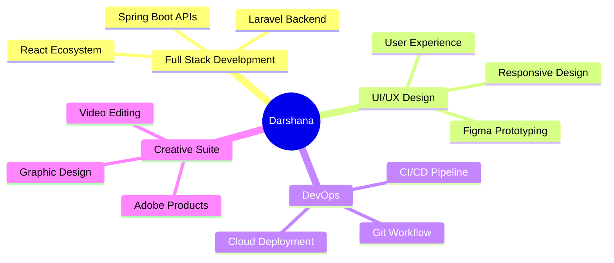

<div align="center">

# 👋 Welcome to My Digital Workspace

### I'm Darshana Jayalath
**Full Stack Developer | Creative Technologist | Problem Solver**


[](https://github.com/darshana-jayalath)
[](https://linkedin.com/in/darshanajayalath)
[](mailto:darshanajayalath0@gmail.com)

</div>

---

## 🚀 About Me

```javascript
const darshana = {
    location: "Sri Lanka 🇱🇰",
    currentFocus: "Building innovative web solutions",
    learning: ["Spring Boot", "React Ecosystem", "Laravel"],
    funFact: "I think I'm funny in speaking 😄",
    availableFor: "Freelance projects & collaborations"
};
```

- 🔭 Currently working on: **Local Product Marketplace Web Application**
- 🌱 Learning: **Spring Boot, Advanced React, Laravel**
- 💡 Ask me about: **React, PHP, Full Stack Development**
- 🎯 2024 Goals: Master microservices architecture & cloud deployment

---

## 💻 Tech Stack

### 🎨 Frontend Development
<div align="center">


</div>

### ⚙️ Backend Development
<div align="center">


</div>

### 🗄️ Database Technologies
<div align="center">


</div>

### 🛠️ Development Tools
<div align="center">


</div>

### 🎨 Design & Creative Suite
<div align="center">


</div>

### 💻 Operating Systems
<div align="center">


</div>

---

## 📊 GitHub Statistics

<div align="center">
  
  
</div>

<div align="center">
  
</div>

---

## 🏆 GitHub Trophies

<div align="center">
  
[](https://github.com/ryo-ma/github-profile-trophy)

</div>

---

## 📈 Contribution Graph

<div align="center">
  
[](https://github.com/ashutosh00710/github-readme-activity-graph)

</div>

---

## 🎯 Current Focus



---

## 🤝 Let's Connect

<div align="center">

[](https://linkedin.com/in/darshanajayalath)
[](https://fb.com/darshana%20jayalath)
[](mailto:darshanajayalath0@gmail.com)

</div>

---

<div align="center">

### 💡 "Code is like humor. When you have to explain it, it's bad." – Cory House


**⭐️ From [Darshana Jayalath](https://github.com/darshana-jayalath)**

</div>
