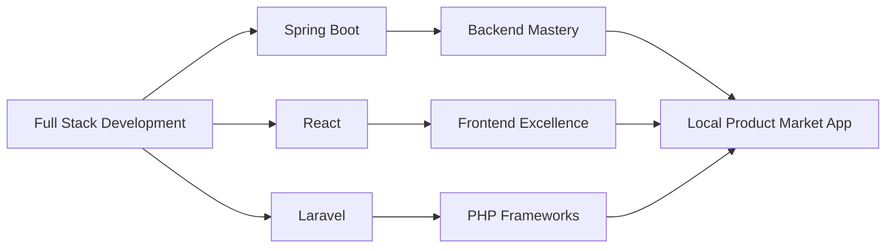

<div align="center">

# 👨‍💻 Darshana Jayalath

### Full Stack Developer | Creative Technologist | Problem Solver


[](https://linkedin.com/in/darshanajayalath)
[](https://fb.com/darshana%20jayalath)
[](mailto:darshanajayalath0@gmail.com)


</div>

---

## 🚀 About Me

```javascript
const darshana = {
    location: "Sri Lanka 🇱🇰",
    currentProject: "Local Product Market Web App",
    learning: ["Spring Boot", "React", "Laravel"],
    interests: ["Web Development", "UI/UX Design", "Creative Coding"],
    funFact: "I think I'm funny in speaking 😄",
    askMeAbout: ["React", "PHP", "Full Stack Development"],
    reachMe: "darshanajayalath0@gmail.com"
};
```

---

## 💻 Tech Stack

### 🎨 Frontend Development
<p align="left">


</p>

### ⚙️ Backend Development
<p align="left">


</p>

### 🗄️ Databases
<p align="left">


</p>

### 🛠️ Tools & Technologies
<p align="left">


</p>

### 🎨 Design Suite
<p align="left">


</p>

---

## 📊 GitHub Statistics

<div align="center">
  
  
</div>

<div align="center">
  
</div>

<div align="center">
  
</div>

---

## 🏆 GitHub Trophies

<div align="center">
  
</div>

---

## 📈 Contribution Snake

<div align="center">
  
</div>

---

## 💡 Random Dev Quote

<div align="center">
  
</div>

---

## 🎯 Current Focus



---

## 📫 Let's Connect!

<div align="center">

### 💬 Open to collaborate on innovative projects!

**If you have an exciting project or opportunity, feel free to reach out:**

📧 darshanajayalath0@gmail.com


</div>

---

<div align="center">
  
### ⭐️ From [Darshana Jayalath](https://github.com/darshana-jayalath)

**"Code is like humor. When you have to explain it, it's bad!"** 😄

</div>
